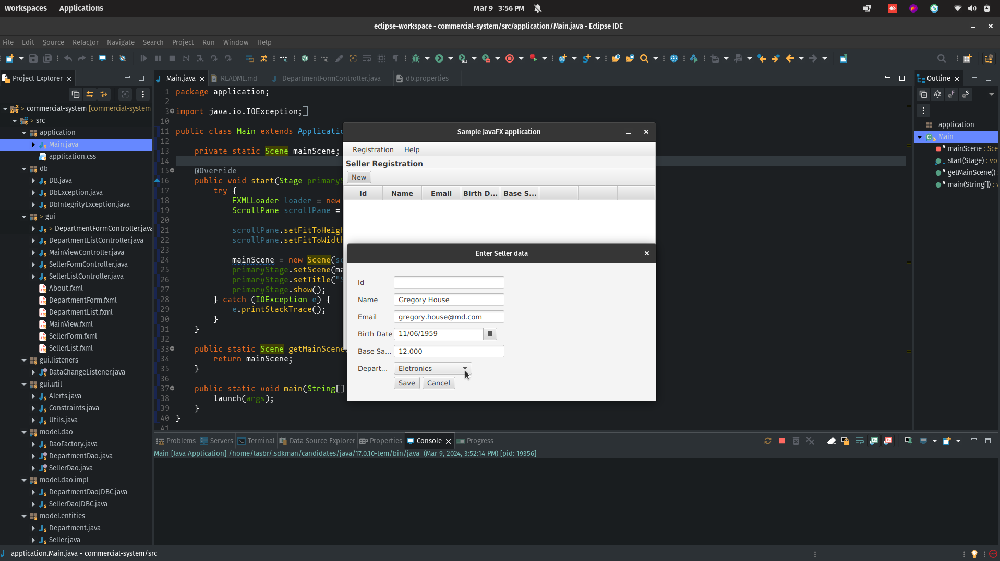
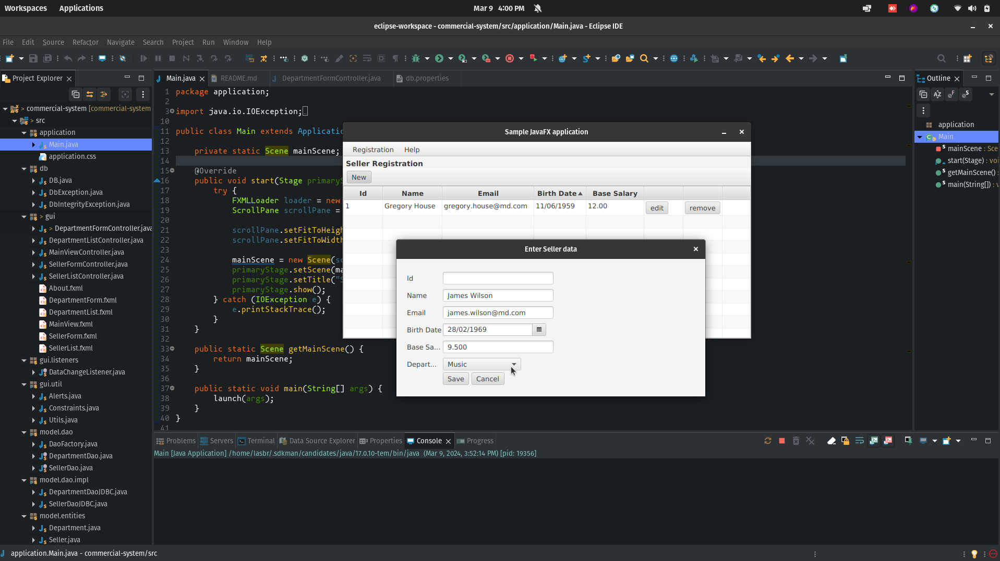

# Commercial System JavaFX 

## Project Overview

Commercial system made in JavaFX for registering departments and sellers. The seller is allocated to a previously registered department.

## Technologies Used

- Java version 17
- JavaFX version 17
- SceneBuilder
- MySQL
- Docker


## Project Structure

### package application

Contain the main class to run the Project, where PrimaryStage loads.

### package db

The `DB` class is responsible for managing the connection to the database using the Singleton pattern. The class includes methods for getting a connection, closing the connection, loading database properties from a `db.properties` file, and closing `Statement` and `ResultSet` objects. In case of exceptions during execution, two custom exception classes, `DbException` and `DbIntegrityException`, are thrown. The former deals with general database errors, while the latter is specific to integrity violations. This structure provides an abstraction for manipulating the database, making the code more modular and encapsulated.

### package gui 

#### MainViewController and MainView.fxml
- **MainViewController:**
  - **Role:** The `MainViewController` class is responsible for controlling the main view of the application.
  - **MainView.fxml:** This FXML file is associated with the `MainViewController` class. It defines the main structure of the graphical interface, including a Menu Bar with "Registration" and "Help" menus. It provides options for managing sellers and departments, as well as "About" information.

#### SellerListController and SellerList.fxml
- **SellerListController:**
  - **Role:** The `SellerListController` class controls the logic related to displaying the list of sellers in the application.
  - **SellerList.fxml:** This FXML file is linked to the `SellerListController` class. It defines the graphical interface for listing sellers, featuring a TableView with details and buttons for interactions.

#### SellerFormController and SellerForm.fxml
- **SellerFormController:**
  - **Role:** The `SellerFormController` class manages the logic for adding and editing seller information in the application.
  - **SellerForm.fxml:** Associated with the `SellerFormController`, this FXML file defines the interface for inserting or editing seller data. It includes fields such as Id, Name, Email, Birth Date, Base Salary, and Department, with "Save" and "Cancel" buttons.

#### DepartmentListController and DepartmentList.fxml
- **DepartmentListController:**
  - **Role:** The `DepartmentListController` class controls the logic for displaying the list of departments in the application.
  - **DepartmentList.fxml:** This FXML file is linked to the `DepartmentListController` class. It defines the interface for listing departments, including a TableView and buttons for interactions.

#### DepartmentFormController and DepartmentForm.fxml
- **DepartmentFormController:**
  - **Role:** The `DepartmentFormController` class manages the logic for adding and editing department information.
  - **DepartmentForm.fxml:** Associated with the `DepartmentFormController`, this FXML file defines the interface for adding or editing department information. It includes fields for department Id and Name, error labels, and "Save" and "Cancel" buttons.

#### About.fxml
- **Role:** It is used to display information about the JavaFX Application Demo. It presents a VBox layout with a large "About" label followed by details about the application.

### package gui.listeners Interface

- **Interface:** DataChangeListener
- **Description:** The `DataChangeListener` interface defines a contract for classes that want to be notified.

### gui.util

The `Alerts` class provides utility methods for displaying various types of JavaFX Alerts, such as informational alerts and confirmation dialogs.

- **Methods:**
  1. `showAlert(String title, String header, String content, AlertType type)`: Displays a basic alert with the specified title, header, content, and type.
  2. `showConfirmation(String title, String content)`: Shows a confirmation dialog with the specified title and content, returning an Optional containing the user's choice.

The `Constraints` class offers utility methods for applying constraints to JavaFX TextField components.

- **Methods:**
  1. `setTextFieldInteger(TextField txt)`: Restricts a TextField to accept only integer values.
  2. `setTextFieldMaxLength(TextField txt, int max)`: Limits the length of the input in a TextField to the specified maximum.
  3. `setTextFieldDouble(TextField txt)`: Allows a TextField to accept only double values.

The `Utils` class contains various utility methods for common tasks within the JavaFX application.

- **Methods:**
  1. `currentStage(ActionEvent event)`: Retrieves the current Stage based on the source of the ActionEvent.
  2. `tryParseToInt(String str)`: Attempts to parse a String into an Integer, returning null if unsuccessful.
  3. `tryParseToDouble(String str)`: Attempts to parse a String into a Double, returning null if unsuccessful.
  4. `formatTableColumnDate(TableColumn<T, Date> tableColumn, String format)`: Formats a TableColumn containing Date values.
  5. `formatTableColumnDouble(TableColumn<T, Double> tableColumn, int decimalPlaces)`: Formats a TableColumn containing Double values.
  6. `formatDatePicker(DatePicker datePicker, String format)`: Configures the formatting for a DatePicker based on the specified pattern.


### package model.dao

The `DaoFactory` class is responsible for instantiating and providing instances of concrete implementations of DAO interfaces.

- **Methods:**
  1. `createSellerDao()`: Instantiates and returns a new `SellerDaoJDBC` instance.
  2. `createDepartmentDao()`: Instantiates and returns a new `DepartmentDaoJDBC` instance.

The `DepartmentDao` interface defines methods for CRUD (Create, Read, Update, Delete) operations on the `Department` entity.

- **Methods:**
  1. `insert(Department department)`: Inserts a new department into the database.
  2. `update(Department department)`: Updates an existing department in the database.
  3. `deleteById(Integer id)`: Deletes a department by its ID from the database.
  4. `findById(Integer id)`: Retrieves a department by its ID from the database.
  5. `findAll()`: Retrieves all departments from the database.

The `SellerDao` interface defines methods for CRUD (Create, Read, Update, Delete) operations on the `Seller` entity.

- **Methods:**
  1. `insert(Seller seller)`: Inserts a new seller into the database.
  2. `update(Seller seller)`: Updates an existing seller in the database.
  3. `deleteById(Integer id)`: Deletes a seller by its ID from the database.
  4. `findById(Integer id)`: Retrieves a seller by its ID from the database.
  5. `findAll()`: Retrieves all sellers from the database.
  6. `findByDepartment(Department department)`: Retrieves all sellers belonging to a specific department.


### package model.dao.impl

The `DepartmentDaoJDBC` class provides a JDBC implementation of the `DepartmentDao` interface.

- **Methods:**
  1. `insert(Department department)`: Inserts a new department into the database.
  2. `update(Department department)`: Updates an existing department in the database.
  3. `deleteById(Integer id)`: Deletes a department by its ID from the database.
  4. `findById(Integer id)`: Retrieves a department by its ID from the database.
  5. `findAll()`: Retrieves all departments from the database.

The `SellerDaoJDBC` class provides a JDBC implementation of the `SellerDao` interface.

- **Methods:**
  1. `insert(Seller seller)`: Inserts a new seller into the database.
  2. `update(Seller seller)`: Updates an existing seller in the database.
  3. `deleteById(Integer id)`: Deletes a seller by its ID from the database.
  4. `findById(Integer id)`: Retrieves a seller by its ID from the database.
  5. `findAll()`: Retrieves all sellers from the database.
  6. `findByDepartment(Department department)`: Retrieves all sellers belonging to a specific department.

The `Department` class represents a department entity.

- **Fields:**
  1. `id (Integer)`: Unique identifier for the department.
  2. `name (String)`: Name of the department.

### package model.entities

The `Seller` class represents a seller entity.

- **Fields:**
  1. `id (Integer)`: Unique identifier for the seller.
  2. `name (String)`: Name of the seller.
  3. `email (String)`: Email address of the seller.
  4. `birthDate (Date)`: Date of birth of the seller.
  5. `baseSalary (Double)`: Base salary of the seller.
  6. `department (Department)`: Department to which the seller belongs.

### package model.exceptions

The `ValidationException` class extends `RuntimeException` and is used to handle validation errors in the application.

- **Fields:**
  1. `errors (Map<String, String>)`: Map containing field names and corresponding error messages.

### package model.services

The `DepartmentService` class provides high-level service methods related to the `Department` entity.

- **Methods:**
  1. `findAll()`: Retrieves all departments.
  2. `saveOrUpdate(Department obj)`: Saves or updates a department.
  3. `remove(Department obj)`: Removes a department.

The `SellerService` class provides high-level service methods related to the `Seller` entity.

- **Methods:**
  1. `findAll()`: Retrieves all sellers.
  2. `saveOrUpdate(Seller obj)`: Saves or updates a seller.
  3. `remove(Seller obj)`: Removes a seller.
  
  
## Note for Users

To use this application, it is required to have MySQL installed natively on your machine or to create a Docker instance. Follow the instructions below based on your preference:

### Native Installation of MySQL

Make sure to have MySQL installed on your machine. You can download MySQL from [mysql.com](https://www.mysql.com/downloads/) and follow the installation instructions.

### MySQL Docker Instance

If you prefer to use a Docker instance, run the following command in the terminal:

```bash
docker run -d \
    --name mysql_dev \
    -p 3306:3306 \
    -e MYSQL_ROOT_PASSWORD=password \
    -v mysql-database:/var/lib/mysql \
    --network REDEMSQL \
    mysql:latest
```

This command creates a Docker container named mysql_dev with a MySQL instance. Make sure to replace password with your desired password.

### Accessing MySQL via Terminal
To access MySQL via the terminal, use the following command:

```bash
docker exec -it mysql_dev mysql -uroot -p
```

You will be prompted for the password (in the example, password). After entering the correct password, you will be connected to the MySQL instance.

### Workbench or Other MySQL Clients

If you prefer using a graphical client like MySQL Workbench, use the following credentials:

- `Host: localhost (or 127.0.0.1)
- `Port:` 3306
- `User:` root
- `Password:` password
- `Remember to adjust the settings as needed.

For any questions, refer to the MySQL documentation or reach out to support.

## Screenshots







